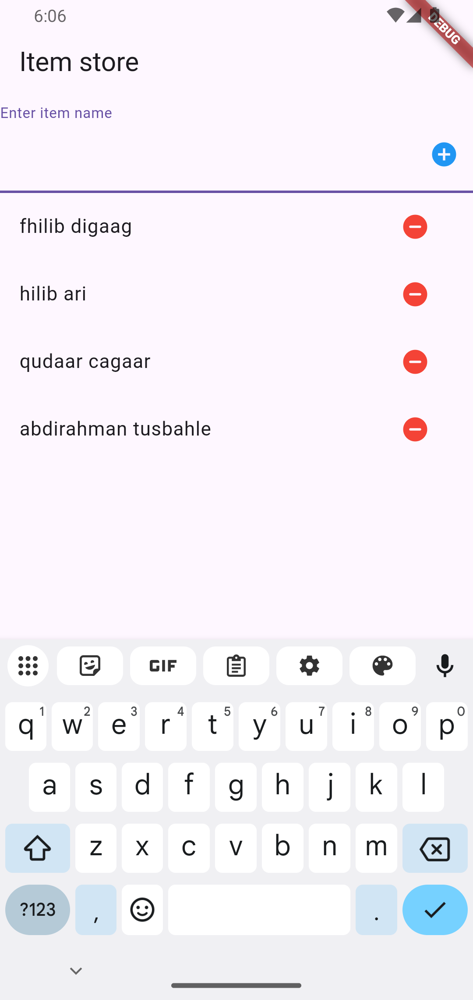

# Flutter State Management Using Provider

Welcome to our GitHub repository for the Flutter State Management tutorial! This code accompanies our live class tutorial, which you can watch on YouTube to learn how to manage data in your apps using the Provider package.

## About the Author

**Abdirahman Tusbahle**
- Profession: Software Developer and Teacher
- Email: [abdirahman.tusbahle@gmail.com](mailto:abdirahman.tusbahle@gmail.com)

## Technology Stack

This application is built with the following technologies:
- **Flutter**: A powerful UI toolkit for building natively compiled applications for mobile, web, and desktop from a single codebase.
- **Provider Package**: A wrapper around InheritedWidget to make it easier to handle and optimize.

## Screenshots

Here's a look at the application in action:



## Watch the Tutorial

Check out the tutorial on YouTube here: [Watch the Tutorial](https://youtu.be/VKiEtcLv9Qw)

## What Will You Learn?

- Basics of managing state in Flutter apps
- Setting up the Provider package
- Examples to help you understand how to use the code

## How to Use This Code

To use this code, follow these steps:

1. **Clone the Repository:**
   Copy the repository by running:
   ```bash
   git clone https://github.com/Tusbahle/flutter_providor_statemanagement.git

2. **Navigate to the Project Directory:** Change into the project directory with:
   ```bash
   flutter pub get

3. **Run the App:** Execute the following command to start the app:
   ```bash
   flutter run


   Contact
If you have any questions or feedback, please don't hesitate to reach out at abdirahman.tusbahle@gmail.com.